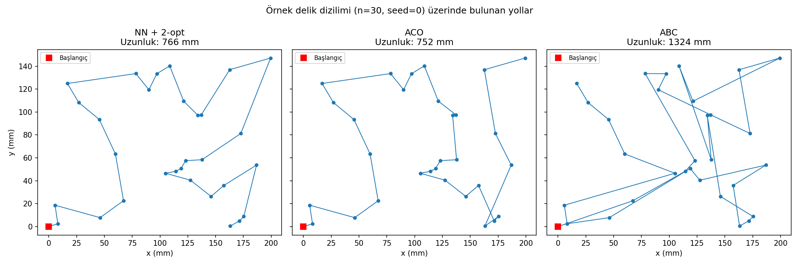
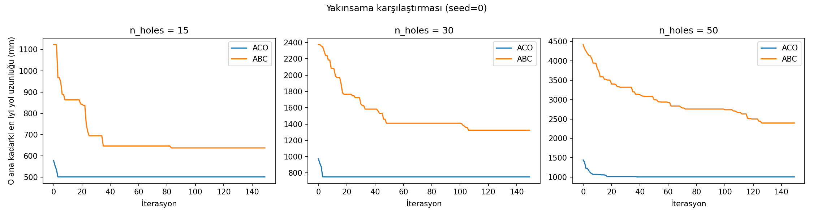
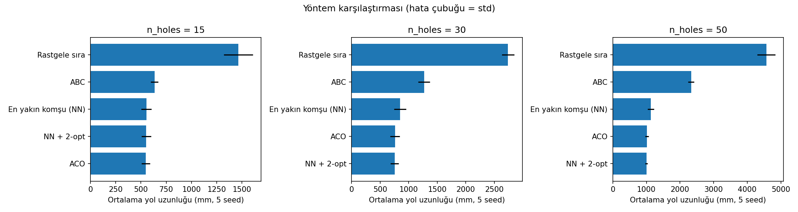
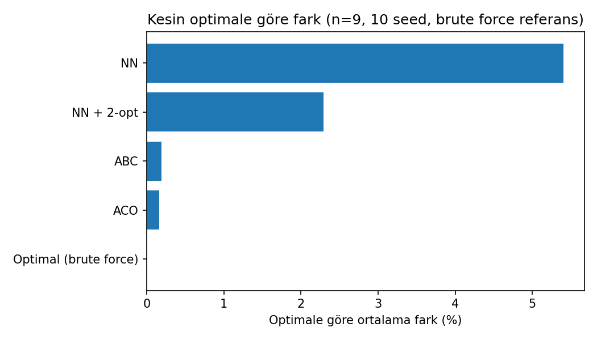
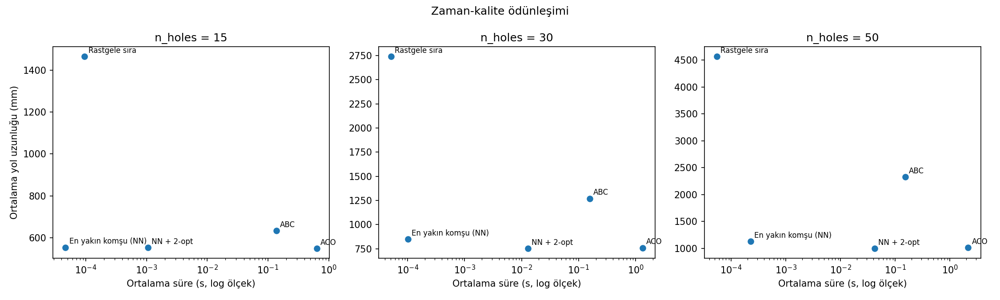

# Delik Delme Yolu Optimizasyonu: ACO vs ABC vs Klasik Sezgiseller

CNC delik delme operasyonunda, delikler arasında dolaşırken kat edilen
toplam mesafeyi (dolayısıyla işleme süresini) azaltmak klasik bir yol
optimizasyonu problemidir. Bu depo, **sentetik** delik konumları
üzerinde iki metasezgisel yöntemi (Karınca Kolonisi Optimizasyonu —
ACO, Yapay Arı Kolonisi — ABC) iki klasik sezgiselle (en yakın komşu,
en yakın komşu + 2-opt) ve rastgele sırayla karşılaştırır.

> **Kapsam notu:** Bu depodaki veriler tamamen sentetiktir (rastgele
> üretilmiş delik koordinatları). Herhangi bir firmaya, parçaya veya
> gerçek üretim verisine ait bilgi içermez. Amaç belirli bir üretim
> hattını optimize etmek değil, algoritmaların davranışını genel bir
> TSP-benzeri problemde karşılaştırmaktır.

## Problem tanımı
Bir levha üzerinde `N` adet delik rastgele konumlandırılır. Delme ucu
sabit bir başlangıç noktasından (origin) başlar ve tüm delikleri tek
tek ziyaret eder; başlangıca geri dönmesi gerekmez (açık tur). Amaç,
toplam Öklid yol uzunluğunu minimize eden ziyaret sırasını bulmaktır.
Bu, Gezgin Satıcı Problemi'nin (TSP) açık-tur varyantıdır.

## Yöntemler
- **Rastgele sıra** — alt sınır referansı
- **En yakın komşu (NN)** — açgözlü sezgisel
- **NN + 2-opt** — NN çıktısının yerel aramayla iyileştirilmesi
- **ACO** — feromon izi + mesafe-tabanlı sezgisel ile olasılıksal yol inşası
- **ABC** — çalışan/gözcü/kaşif arı fazlarıyla, komşuluk hareketi olarak swap kullanan kombinatoryal uyarlama

Tüm yöntemler `src/` altında sıfırdan (NumPy ile) uygulanmıştır,
hazır bir TSP kütüphanesi kullanılmamıştır.

## Deney tasarımı
- Delik sayısı: 15, 30, 50
- Her boyut için 5 farklı rastgele tohum (seed)
- ACO ve ABC: 150 iterasyon, parametreler `src/run_experiment.py` içinde sabit

## Sonuçlar

**Ortalama yol uzunluğu (mm), 5 seed üzerinden:**

| n_holes | Yöntem | Ortalama | Std |
|---|---|---|---|
| 15 | ACO | 548 | 43 |
| 15 | NN + 2-opt | 553 | 49 |
| 15 | NN | 554 | 50 |
| 15 | ABC | 634 | 38 |
| 30 | NN + 2-opt | 753 | 73 |
| 30 | ACO | 759 | 84 |
| 30 | NN | 848 | 106 |
| 30 | ABC | 1271 | 103 |
| 50 | NN + 2-opt | 999 | 39 |
| 50 | ACO | 1013 | 52 |
| 50 | NN | 1132 | 93 |
| 50 | ABC | 2329 | 93 |

(Tam tablo: `results/comparison_summary.csv`, ham veri: `results/comparison_raw.csv`)





**Bulgular:**
- **ACO, NN+2-opt'a çok yakın performans gösteriyor** ve problem
  büyüdükçe (n=50) basit NN sezgiselini belirgin biçimde geçiyor.
- **ABC, n=15/30/50'de tüm boyutlarda en kötü performanslı yöntem** —
  rastgele sıradan iyi ama NN'den bile kötü. Şekil 1'de ABC'nin
  bulduğu rotanın gözle görülür biçimde çapraz geçişli ve verimsiz
  olduğu görülüyor. **Ancak küçük `n=9`'da ABC, ACO'ya neredeyse eşit
  ve optimale çok yakın** (aşağıdaki "Optimale göre fark" bölümüne
  bakın) — yani bu bir ölçek etkisi, ABC'nin her boyutta kötü olduğu
  anlamına gelmiyor.
- Bu zayıflık, ABC'nin TSP için yapısal olarak kötü olduğu anlamına da
  gelmiyor; burada kullanılan **komşuluk operatörü basit bir swap** ve
  bu, literatürdeki daha gelişmiş ABC-TSP uyarlamalarına (ör.
  insertion, inversion tabanlı komşuluk, yerel arama ile hibritleme)
  göre `n` büyüdükçe zayıf kalıyor. Yani buradaki sonuç "ABC kötüdür"
  değil, **"bu basit swap-tabanlı ABC uygulaması, `n` büyüdükçe ACO ve
  2-opt'un gerisinde kalıyor"** şeklinde okunmalı.
- Yakınsama grafiğinde (Şekil 2) ACO çok hızlı (yaklaşık 10-20
  iterasyonda) platoya ulaşıyor; ABC çok daha yavaş iyileşiyor ve daha
  yüksek bir platoda kalıyor.

## Optimale göre fark (n=9, kaba kuvvet referans)

Kaba kuvvet (brute force) yalnızca küçük `n` için hesaplanabilir
(`n!` karmaşıklığı). `n=9` için tüm yöntemleri 10 farklı tohumda kesin
optimale göre karşılaştırdık:

| Yöntem | Optimale göre ortalama fark | Maks. fark | Ortalama süre |
|---|---|---|---|
| Optimal (brute force) | %0.00 | %0.00 | 3.21 s |
| ACO | %0.16 | %1.60 | 0.43 s |
| ABC | %0.19 | %1.16 | 0.16 s |
| NN + 2-opt | %2.29 | %10.73 | 0.0006 s |
| NN | %5.40 | %20.52 | 0.00005 s |



Bu küçük boyutta **ABC ve ACO neredeyse birbirine eşit** ve optimale
çok yakın; NN+2-opt'un gerisinde değil, önünde. Bu, ana karşılaştırma
tablosundaki (n=15/30/50) sonuçla çelişir gibi görünebilir — orada ABC
açıkça en kötü yöntemdi. Çelişki değil, **ölçek etkisi**: ABC'nin
swap-tabanlı komşuluk operatörü küçük `n`'de yeterliyken, `n` arttıkça
arama uzayı büyüdüğü için aynı sayıda iterasyonda (150) yetersiz
kalıyor. ACO ise feromon mekanizması sayesinde büyüyen `n`'de de
rekabetçi kalıyor.

## Zaman-kalite ödünleşimi



Ana karşılaştırmadaki (n=15/30/50, 5 seed) ortalama çalışma süreleri:

| Yöntem | n=15 | n=30 | n=50 |
|---|---|---|---|
| NN | 0.00005 s | 0.0001 s | 0.0002 s |
| NN + 2-opt | 0.001 s | 0.013 s | 0.042 s |
| ABC | 0.138 s | 0.156 s | 0.152 s |
| ACO | 0.638 s | 1.321 s | 2.164 s |

Buradaki en çarpıcı nokta şu: **NN+2-opt, ACO'nun ürettiği kaliteye
çok yakın bir sonucu, ACO'dan yüz kat daha kısa sürede üretiyor**
(n=50'de 0.04 s'ye karşı 2.16 s). Bu problem boyutunda ve bu
uygulamada, metasezgisel yöntemlerin (özellikle ACO'nun) getirdiği
kalite artışı, klasik 2-opt yerel aramasına kıyasla hesaplama
maliyetini haklı çıkaracak kadar büyük değil. ABC ise hem daha yavaş
hem daha düşük kaliteli olduğu için (n≥15'te) bu ödünleşimde hiçbir
noktada tercih edilir değil.

Bu bulgu, "metasezgisel her zaman daha iyidir" varsayımına karşı somut
bir karşı örnek: yöntem seçimi problem boyutuna ve hesaplama bütçesine
bağlı olmalı, sabit bir hiyerarşi yok.

## Sınırlılıklar
- Sentetik veri; gerçek bir parça geometrisi veya tezgah kısıtı
  (ivme, tezgah dinamiği, takım değişim süresi) modellenmemiştir.
- ABC'nin komşuluk operatörü kasıtlı olarak basit tutulmuştur; daha
  güçlü bir uyarlama farklı sonuç verebilir.
- Parametre taraması yapılmamıştır (ACO/ABC parametreleri tek bir
  makul değerde sabitlenmiştir); sonuçlar parametre seçimine duyarlı
  olabilir.
- Karşılaştırma tek bir problem ailesi (düzlemde rastgele uniform
  dağılım) üzerindedir.

## Çalıştırma
```bash
pip install -r requirements.txt
python -m src.run_experiment        # results/comparison_*.csv, convergence_seed0.csv
python -m src.make_figures          # results/figures/fig1-3
python -m src.run_optimality_gap    # results/optimality_gap_*.csv (n=9, brute force)
python -m src.make_figures_extra    # results/figures/fig4-5
```

## Yapı
```
src/
  problem.py               Delik üretimi, yol uzunluğu, mesafe matrisi
  baselines.py             Rastgele sıra, NN, 2-opt
  aco.py                   Karınca Kolonisi Optimizasyonu
  abc_algorithm.py          Yapay Arı Kolonisi
  exact.py                  Küçük n için kaba kuvvet optimal çözüm
  run_experiment.py        Ana karşılaştırma deneyi (n=15/30/50)
  run_optimality_gap.py    Optimale göre fark deneyi (n=9)
  make_figures.py          Şekil 1-3
  make_figures_extra.py    Şekil 4-5 (optimallik farkı, zaman-kalite)
results/
  comparison_raw.csv, comparison_summary.csv, comparison_timing.csv,
  convergence_seed0.csv, optimality_gap_raw.csv, optimality_gap_summary.csv
  figures/                 Beş karşılaştırma grafiği
```
